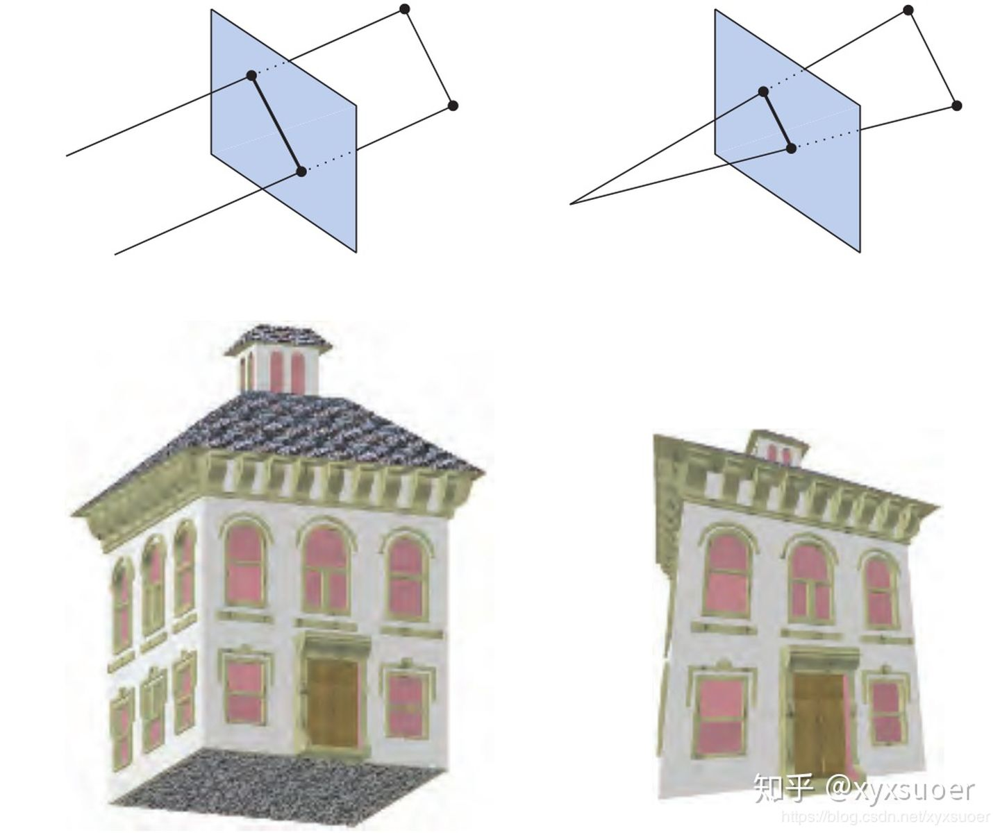

1. 管线的主要方法是：传入一个虚拟摄像机、三维物体、光源和其他，生成或者说渲染一个二维图片
2. 物体在屏幕中的的位置和形状被他们在环境中的几何、特征和摄像机在环境中的位置所决定
3. 物体的外观收到材质属性、光源、纹理、着色公式所影响

## 架构Architecture
 管线由几个阶段组成，每一个阶段执行任务的一部分，管线每个阶段是并行执行的，每个阶段依赖于上一个阶段的结果。实时渲染管线可以粗略的分为四个阶段

```
    1.Application 应用阶段
    2.Geometry Processing 几何处理阶段
    3.Rasterization 光栅化阶段
    4.Pixel Processing 像素处理阶段
```

这些阶段通常也是一个管线
渲染速度通过帧每秒（FPS） 也可以通过赫兹Hz来表示

### 应用阶段


### 几何处理阶段
处理如变换（Transform）、投影（Projection） 和其他所有类型的几何处理，在这个阶段计算是否被绘制，如何被绘制，和在哪里被绘制

### 光栅化阶段
通常认为是利用三个顶点作为输入，构建三角形，找到所有在该三角形内的像素，然后将它们转发给下个阶段

### 像素处理阶段
 每像素执行一段程序来决定该像素的颜色，也许会执行深度测试来判断它是否显示，也许会执行逐像素操作判断是否和上一个颜色混合出新的颜色


## 应用阶段 Application Stage
1. 开发者可以在应用阶段获得完全的控制，因为它通常在CPU上执行
2. 在该阶段做出的改动也会影响到随后阶段的性能，如在应用阶段的一些算法或者设置可以减少绘制的三角形数
3. 在某些应用程序的工作可以在GPU上执行，通过使用一种被叫做**Computer Shader**的单独的模式。这种模式将GUP视作高并行的通用处理器，忽略其特定的渲染图形功能
4. 在应用阶段的最后，将被渲染的几何会被提交给几何处理阶段。这些**渲染图元（rendering primitives）**,如点、线、和三角形，之后将呈现在屏幕中，这是应用阶段最重要的任务
5. 基于软件处理的该阶段是无法像几何处理阶段、光栅化或像素处理阶段一样被分割成子阶段的。然而，为了提高性能，该阶段经常在几个并行的处理器核心中执行。在CPU的设计中，这叫做**超标量体系结构（superscalar construction）**。它允许执行几个进程在同一个时间同一阶段
6. 通常**碰撞检测（collision detection）**的处理实现在该阶段。一个碰撞被检测到在两个物体之间，一个响应或许会产生，例如反馈给碰撞的物体，及碰撞产生的力反馈。在这个阶段也会关心其他的输入源，如键盘，鼠标或者头戴式显示器。根据这个输入，几种不同的行为也许会被执行。**加速算法（acceleration algorithms）**，例如特定的裁剪算法也会在该阶段执行，以及其他的管线无法处理的工作

## 几何处理阶段 Geometry Processing Stage
1. 几何处理阶段在GPU中主要负责大多数的逐三角形和逐顶点操作。

2. 几何处理阶段进一步分成了一下几个功能阶段：
   
```
    顶点着色（vertex shading） -> 投影（projection） -> 裁剪（clipping） -> 屏幕映射（screen mapping）
```


### 顶点着色 Vertex Shading
1. 顶点着色有两个主要的任务
    （1）计算顶点的位置
    （2） 求出程序可能需要的顶点输出数据，例如法线，纹理坐标
2. 以前，一个物体的大部分着色会被计算，通过应用光照到每个顶点的位置和法线然后将结果颜色存储到这个顶点。这些颜色将会在三角形中进行插值。因此可编程的顶点处理单元被称作顶点着色
3. 随着现代GPU的提高，一些或者全部着色是逐像素发生的，顶点着色阶段变得更为简单，甚至不需要计算任何的着色方程。这依赖于程序员的目的
4. 顶点着色器现在是一个更一般的单元，设置与每个顶点相关的数据
5. 在通向屏幕的这条路上，一个模型被变换到几个不同的空间或者坐标戏中。最开始，一个模型存在于他自己的**模型空间（model space）** 中，简单来说，此时它还没有被变换过。每个模型可以与一个**模型变换（model transform）** 联系起来，因此它可以行被移动或者改变朝向。也可能一个模型与几个模型变换联系在一起。这就允许各自相同模型的副本（称为**实例 instances** ）拥有不同的位置，朝向，和大小，在相同场景中，而不需要改变模型的基本几何形状
6. 模型的顶点和法线通过**模型变换（model transform）** 进行变换。一个物体的坐标被叫做**模型坐标（model coordinates）** ，**模型变换** 应用到这些坐标后，这个模型就可以说是被放置于**世界（world）** 或 **世界空间（world space）** 中了。**世界空间** 是独一无二的。之后模型通过各自的**模型变换** 变换之后，所有的模型就存在于相同的空间中了
7. 只有模型被摄像机或者观察者看见才会被渲染。摄像机在**世界空间** 中有一个位置和方向。被用来放置摄像机的位置和调整朝向。为了方便投影和裁剪，摄像机和所有的模型都会通过**视图变换（view transform）** 进行变换。**视图变换** 的目的是将摄像机放置在原点并调整它的朝向，使摄像机看向Z轴的负方向，且Y轴朝上，X轴朝右。我们约定的-Z轴，有些文中是看向+Z轴。这是语义上的不同，对于从-Z变换到+Z而言是简单的。经过**视图变换** 之后的实际位置和方向是通过底层的API决定的。这个空间因此被称作为**摄像机空间（camera space）** 或者通常来说，叫做 **视图空间/观察空间（view space）** 或者 **视野空间（eye space）** 
8. **模型变换** 和 **视图变换** 都会用到4x4矩阵
9. 
10. 决定一个光照在材质上的影响的操作叫做**着色（shading）** 。它包含计算在物体上的各种各样的点的**着色公式（shading equation）**。典型的，一些计算是在几何处理阶段在模型的顶点上被执行，另外一些在逐像素处理阶段被执行。
11. 各种材质数据可以被存储在每个顶点上，例如点的位置，一个法线，一个颜色，或者任何计算着色公式需要的数字化的信息。
12. 顶点着色的结果（可以是颜色、顶点、纹理坐标、以及任何其他种类的着色数据）会被发送到光栅化阶段和像素处理阶段，插值后用来计算表面的着色。
13. 顶点着色的一部分是，渲染系统执行**投影（projection）**，之后是**剔除（clipping）**
14. 通过变换将视体卷进一个极值点为（-1，-1，-1）和（1,1,1）的单位立方体中。不同的范围定义相同的体积可以被使用，例如0<= z <=1。这个单位立方体被叫做**标准化视体（canonical view volume）**  。第一个被执行的是**投影** ，在GPU 中通过顶点着色器来被执行。
15. 有两种常见的**投影方法** ， 叫做**正交投影（orthographic projection）（也被称为平行投影（parallel projection））** 和 **透视投影（perspective projection）** 。事实上，**正交**只是**平行投影** 中的一种。另外几种被使用，在建筑领域，如斜投影和三向投影
16. 
17. 投影通过一个矩阵表示，它通常会和其他的几何变换组合在一起
18. 正交视角的视体通常是一个矩形盒子，通过正交投影变换，将视体变换成一个单位立方体。正交投影的主要的特征是通过变换之后平行线依然是平行的。这个变换是一个平移和一个缩放的组合。
19. **透视投影** ：离摄像机远的物体，投影之后更小。另外，平行线在视野中也许会相交。几何学上，这个视体被叫做**截头椎体（frustum）** 。这个**截头椎体**也会被变换成单位立方体
20. 正交变换和投影变换，可以通过4X4的矩阵进行表示。模型经过投影变换后，会进入到**裁剪坐标（clipping coordinates）** 中。这实际是齐次坐标系。这发生在除以w之前。
21. GPU的顶点着色器必须一直输出这个类型的坐标，为了下一功能阶段——**裁剪(Clipping)** 可以正常工作。
22. 通过这些矩阵变换，一个体积变成了另外一个体积，他们之所以被叫做**投影**，是因为之后的显示中，Z轴不会被存储在生成的图片中，但是会被存储在一个**z-buffer** 中。通过这个方式，模型已经从三维投影到了二维中

### 可选的顶点处理 optional vertex processing
1. 每个管线都有顶点处理。当这个处理被完成，就有几个可选的阶段可以在GPU中进行，按顺序分别是：**曲面细分（tessellation）** ， **几何着色（geometry shading）** ， **流式输出（stream output）** 。这些的使用依赖于硬件的能力，不是所有的GPU都有他们，以及程序员的意愿。他们是相互独立的，通常来说他们不会被使用。
2. 通过**曲面细分（tessellation）** ，一个曲面可以被生成通过上当数量的三角形。
3. 我们已经讨论了一些关于三角形，但是到目前为止，在管线中我们只处理了顶点。他们可以被用来代表点、线、三角形、或者其他的物体。顶点可以用来描述一个曲面。一个曲面可以用一组**控制点（patch）** 表示。每个**控制点（patch）** 由一组顶点生成。
4. **曲面细分** 阶段它自己包含了几个阶段——**hull shader（外壳着色器）** ，**tessellator（细分曲面）** ，**domain shader（域着色器）** 。控制点顶点集（sets of patch vertexes）转换为更大的顶点集，之后用于生成更多的三角面集。
5. 摄像机可以为这个场景决定多少的三角形被生成，当靠近控制点（patch）时生成更多的三角形，远离patch时生成更少
6. **几何着色器（geometry shader）** 可以接受各种类型原始图元进行分类，并生成新的顶点。生成的顶点是有数量限制的，输出的图元也是更加有限的。
7. **几何着色器（geometry shader）** 最流行的用法是**粒子生成（particle generation）**。想象一个烟花爆炸，每个火球可以被描述为一个点，一个单独的顶点。**几何着色器** 可以获得每个点，然后将其变成一个朝向观察者的面，并且覆盖几个像素。因此提供了一个更具有说服力的**图元（primitive）** 以方便我们着色
8. **流输出**：该阶段使我们可以把GPU作为一个几何引擎使用。它并没有将我们处理好的顶点输出给管线之后的阶段进而显示在屏幕中，在此刻，我们可以随意地输出到指定的一个数组以供我们使用。这些数据随后可以在CPU中被使用，也可以在GPU中。这个阶段代表性的使用是**模拟粒子（particle simulations）**
9. 这三个阶段是按一下顺序执行的：**曲面细分** -> **几何着色器** -> **流输出** ，他们都可选择的。不管他们是否被选，管线接下来都会检查这组齐次坐标顶点是否在摄像机视野中

### 裁剪 Clipping

1. 在视体重的全部或者部分图元只有通过了光栅化阶段（随后的是像素处理阶段），然后在能在屏幕中绘制出来
2. 一个图元只有完全在视体（view volume）中才会被传递给下一个阶段。图元完全不在视体中则不会被传递给随后的阶段，因此他们并不会被渲染
3. 如果图元一部分在视体中，则需要裁剪
4. 使用了投影矩阵，意味着变换后的图元在单位体积中被裁剪。
5. 在裁剪之前执行视图变换（view transformation）和投影的好处是：可以解决裁剪一致性的问题，图元使用在单位体积被裁剪
6. 一个视体有六个裁剪面（clipping planes），用户可以定义额外的裁剪面进行明显的切割物体，这被称作**分割（sectioning）**

7. 裁剪过程使用投影产生的四个值得齐次坐标进行裁剪
8. 这些值并不会在三角形内进行线性插值在**透视空间（perspective space）** 中
9. 当一个透视投影被使用时，第四个坐标会被需要，这样数据才会被正确地插值和裁剪
10. 最后，**透视除法（perspective division）** 被执行，将三角形放入到三维的**归一化设备坐标（normalized device coordinate）** 中。如前所属，视体的范围在（-1,-1,-1） 到（1,1,1）
11. 几何阶段最后的步骤是将**裁剪空间**转换成**屏幕坐标（window coordinate）**

### 总结关于几个空间与变换的关系
模型自身拥有一个 **模型空间（model space）** ，
通过**模型变换（model transform）**，将模型变换到了 **世界空间(world space)**,
之后通过 **视图变换（view transform）**  ，变换到**摄像机空间（camera space）** 或者说是 **视图空间（view space）** 或者说是**视野空间（eye space）**
随后通过**投影**，将图元变换到了**裁剪空间（clipping space）**中，即一个**单位立方体（unit cube）**中
经过裁剪后，最后被转换成**屏幕坐标（window coordinate）**，结束几何阶段

### 疑惑
透视空间是指的哪个空间？
投影之后是任然在三维坐标系中吗？

